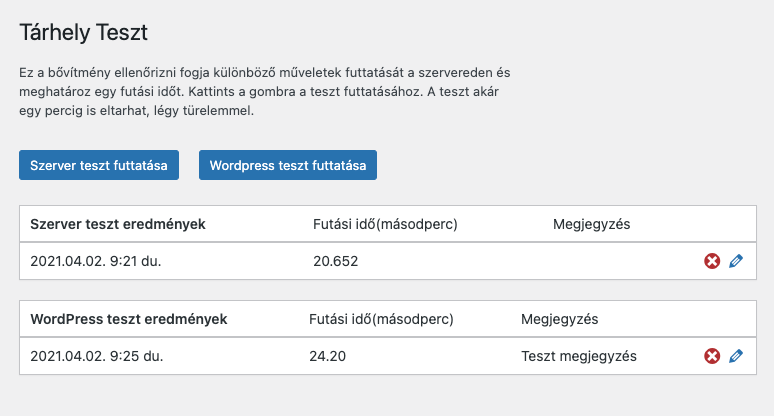

# WP Tárhely Teszt

WordPress bővítmény, amivel a szerver és WordPress sebességét lehet tesztelni.
Telepítés után az eszközök menüpontban találod a Tárhely opciót.

## Changelog

### 1.0.2

- WordPress tesztet kisebb adagokban csinálja meg, hogy ne legyen timeout hiba
- Lehet törölni eredményeket
- Lehet megjegyzés hozzáadni az eredményekhez
